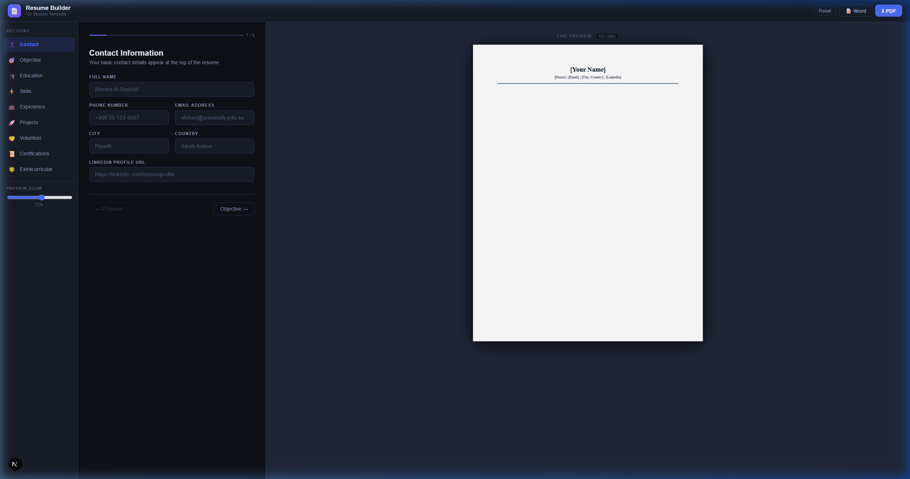

<p align="center">
  
</p>

<h1 align="center">📄 Resume Builder</h1>

<p align="center">
  <strong>A modern, dark-themed resume builder based on the Al Yamamah University (YU) CV Template for Students.</strong><br/>
  Live preview, export to PDF & DOCX — built with Next.js 16, React 19, Zustand, and Tailwind CSS.
</p>

<p align="center">
  
  
  
  
  
  
</p>

---

## 🎓 About

This resume builder is based on the **Al Yamamah University (YU) CV Template for Students** — a structured, professional format designed to help university students create polished resumes. The app digitizes this template into an interactive web experience with real-time preview and one-click exports.

---

## ✨ Features

- 🖊️ **Step-by-step form wizard** — Fill in Contact, Objective, Education, Skills, Experience, Projects, Volunteer, Certifications, and Extracurricular sections
- 👁️ **Live preview** — See your resume update in real-time as you type, rendered in a professional US Letter format
- ⬇️ **Export to PDF** — One-click download as a polished PDF using html2pdf.js
- 📝 **Export to DOCX** — Generate a professionally formatted Word document with the `docx` library
- 🔍 **Adjustable zoom** — Scale the preview pane from 40% to 100%
- 📱 **Responsive layout** — Desktop three-panel layout collapses gracefully on mobile with tabbed Edit / Preview switching
- 🌙 **Dark-mode-first UI** — Sleek dark theme with DM Sans typography and accent glow effects
- 🔄 **Reset with confirmation** — Clear all data with a safety modal
- 💾 **Zustand state management** — Clean, lightweight state powered by Zustand with optional persistence

---

## 🖼️ Screenshots

| Form Editor | Live Preview |
|:-----------:|:------------:|
| Step-by-step section forms with progress bar | Real-time US Letter resume rendering |

---

## 🚀 Getting Started

### Prerequisites

- [Node.js](https://nodejs.org/) 18+
- npm, yarn, pnpm, or bun

### Installation

```bash
# Clone the repository
git clone https://github.com/AbdulrahmanAlaasi/resume-builder.git
cd resume-builder

# Install dependencies
npm install

# Start the development server
npm run dev
```

Open [http://localhost:3000](http://localhost:3000) in your browser.

---

## 🏗️ Project Structure

```
resume-builder/
├── app/
│   ├── components/
│   │   ├── form/              # Form components for each resume section
│   │   │   ├── ContactForm.tsx
│   │   │   ├── ObjectiveForm.tsx
│   │   │   ├── EducationForm.tsx
│   │   │   ├── SkillsForm.tsx
│   │   │   ├── ExperienceForm.tsx
│   │   │   ├── ProjectsForm.tsx
│   │   │   ├── VolunteerForm.tsx
│   │   │   ├── CertificationsForm.tsx
│   │   │   └── ExtracurricularForm.tsx
│   │   └── preview/
│   │       └── ResumePreview.tsx   # Live resume preview (US Letter)
│   ├── lib/
│   │   └── exportUtils.ts     # PDF & DOCX export logic
│   ├── store/
│   │   └── resumeStore.ts     # Zustand state management
│   ├── types/
│   │   └── resume.ts          # TypeScript interfaces
│   ├── globals.css             # Design system & theme
│   ├── layout.tsx              # Root layout
│   └── page.tsx                # Main app page
├── package.json
├── tsconfig.json
├── next.config.ts
└── postcss.config.mjs
```

---

## 📦 Tech Stack

| Technology | Purpose |
|:-----------|:--------|
| **Next.js 16** | React framework with App Router |
| **React 19** | UI library |
| **TypeScript 5** | Type safety |
| **Tailwind CSS 4** | Utility-first styling |
| **Zustand 5** | Lightweight state management |
| **html2pdf.js** | Client-side PDF generation |
| **docx** | DOCX file generation |

---

## 📄 Resume Sections

The builder supports 9 resume sections following a professional template:

1. **Contact** — Name, phone, email, city, country, LinkedIn
2. **Objective** — Career objective statement
3. **Education** — University, degree, graduation date, coursework, awards
4. **Skills** — Technical and soft skills
5. **Experience** — Professional work experience with bullet points
6. **Projects** — Academic or personal projects with descriptions
7. **Volunteer** — Volunteer leadership activities *(optional)*
8. **Certifications** — Professional certifications *(if applicable)*
9. **Extracurricular** — Clubs and interests

---

## 🛠️ Available Scripts

| Command | Description |
|:--------|:------------|
| `npm run dev` | Start the development server |
| `npm run build` | Build for production |
| `npm run start` | Start the production server |

---

## 🤝 Contributing

Contributions are welcome! Feel free to open issues or submit pull requests.

1. Fork the repository
2. Create your feature branch (`git checkout -b feature/amazing-feature`)
3. Commit your changes (`git commit -m 'Add amazing feature'`)
4. Push to the branch (`git push origin feature/amazing-feature`)
5. Open a Pull Request

---

## 📜 License

This project is licensed under the MIT License. See the [LICENSE](LICENSE) file for details.

---

## 👤 Author

**Abdulrahman Alaasi**

- GitHub: [@AbdulrahmanAlaasi](https://github.com/AbdulrahmanAlaasi)

---

<p align="center">
  Made with ❤️ using Next.js & React
</p>
